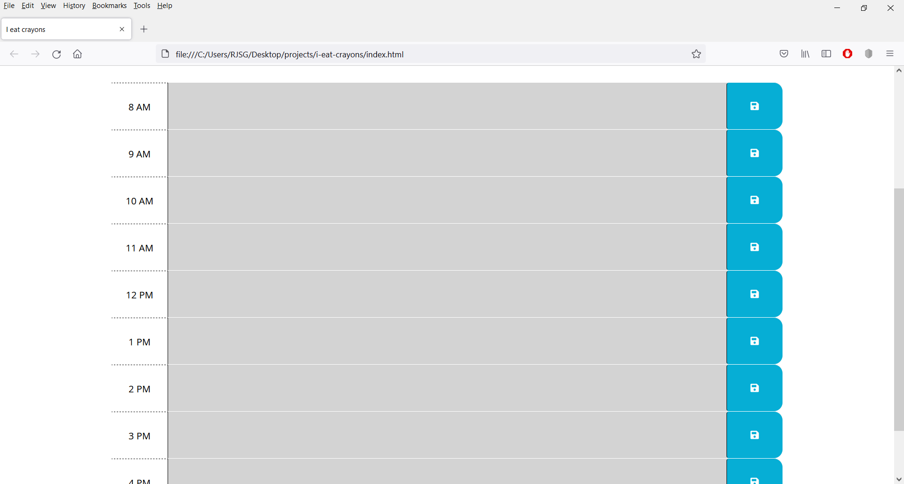
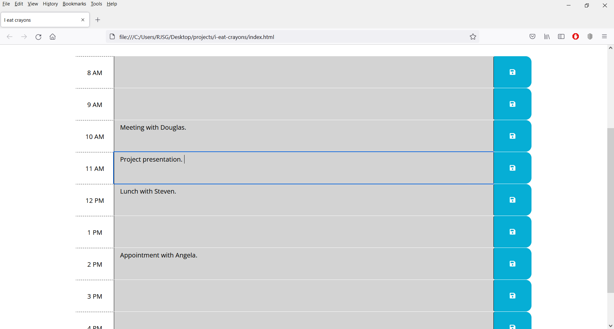

# i-eat-crayons
i eat crayons is a basic work day planner/scheduler 

## languages/techniques used
- moment.js
- javascript
- HTML
- css
- bootstrap

### deployed link
https://box-monkey.github.io/i-eat-crayons/

## screenshots

